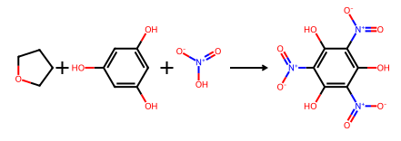
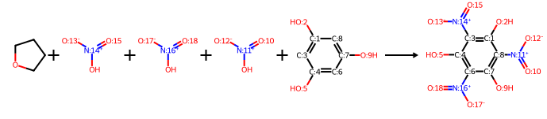

# AgaveChem
[](https://badge.fury.io/py/agave-chem)
[](https://gitHub.com/denovochem/agave_chem/graphs/commit-activity)
[](https://github.com/denovochem/agave_chem/blob/main/LICENSE)
[](https://github.com/denovochem/agave_chem/actions/workflows/tests.yml)
[](https://denovochem.github.io/agave_chem/)
[](https://colab.research.google.com/github/denovochem/agave_chem/blob/main/examples/example_notebook.ipynb)

An open-source Python library for atom-to-atom mapping (AAM) of chemical reactions. AgaveChem provides four composable mappers from deterministic graph-based methods to a supervised neural mapper that can be used individually or combined into a pipeline. The default interface `map_reactions` for extracting atom-mapped reaction SMILES achieves state-of-the-art accuracy on the 1,758 reaction [golden dataset benchmark](https://www.nature.com/articles/s41467-024-46364-y).

| Mapper | Per-reaction mapping accuracy |
| --- | :---: |
| [RXNMapper](https://www.science.org/doi/10.1126/sciadv.abe4166) | 87.09% |
| [RXNMapperv2](https://chemrxiv.org/doi/pdf/10.26434/chemrxiv.15005247/v1) | 89.59% |
| [GraphormerMapper](https://pubs.acs.org/jcisd8/article-abstract/62/14/3307/850123/Bidirectional-Graphormer-for-Reactivity?redirectedFrom=fulltext) | 89.76% |
| [LocalMapper](https://www.nature.com/articles/s41467-024-46364-y) | 89.59% |
| AgaveChem (neural only) | 91.87% |
| AgaveChem (using `map_reactions()`) | 92.72% |

## Mappers

### Neural mapper

- **Supervised ALBERT-based mapper**: Trained in two phases - unsupervised masked language model (MLM) pre-training followed by supervised fine-tuning with a direct attention alignment objective against generated "ground truth" maps
- **Template and MCS-derived "ground truth"**: Supervised training data for the second phase is generated automatically from ~0.97M filtered USPTO reactions; the deterministic pipeline fully maps ~60% of reactions and maps ~90% of all product atoms

### Identical fragment mapper

- **Spectator molecule handling**: Fragments appearing structurally unchanged on both sides of the reaction (counter-ions, solvents, spectator reagents) are detected and atom-mapped before any other mapper is invoked
- **Collision-free numbering**: Pre-assigned atoms use a reserved numbering range to avoid conflicts with downstream mappers

### MCS mapper

- **Environment fingerprint matching**: Identifies invariant atoms using a bond-radius fingerprinting scheme, enabling efficient partial mapping
- **Configurable radius**: A `min_radius_to_anchor_new_mapping` parameter controls how close to the reactive center mapping extends, yielding conservative partial maps that avoid incorrectly assigning atoms near reaction centers
- **Anchor-extend strategy**: Alternates between propagating mappings from already-assigned anchor atoms and seeding new anchors, ensuring consistent multi-fragment mapping

### Expert template mapper

- **Curated SMIRKS library**: Reaction SMIRKS templates sourced from [ReactionFlash](https://apps.apple.com/us/app/reactionflash/id432080813), [Rxn-INSIGHT](https://github.com/mrodobbe/Rxn-INSIGHT), and manual curation are applied to classify and map reactions
- **Custom template support**: User-supplied SMIRKS patterns can supplement or replace the built-in library via `custom_smirks_patterns`

## Requirements

- Python (version >= 3.10)
- RDKit
- [rdchiral-plus](https://github.com/denovochem/rdchiral_plus)
- PyTorch
- Transformers (Hugging Face)

## Installation

Install AgaveChem from PyPi:

```bash
pip install agave_chem
```

Or install AgaveChem with pip directly from this repo:

```bash
pip install git+https://github.com/denovochem/agave_chem.git
```

Or clone and install locally:

```bash
git clone https://github.com/denovochem/agave_chem.git
cd agave_chem
pip install .
```

## Basic usage

### Mapping a batch of reactions through the full pipeline

```python
from agave_chem import map_reactions

reactions = [
    "CC(Cl)(Cl)OC(C)(Cl)Cl.CC(=O)C(=O)O>>CC(=O)C(=O)Cl",
    "OCC(=O)OCCCO.Cl>>ClCC(=O)OCCCO",
]
results = map_reactions(reactions)
for r in results:
    print(r.final_mapping)
```

### Neural mapper

```python
from agave_chem import NeuralReactionMapper

mapper = NeuralReactionMapper("neural_mapper")
result = mapper.map_reaction("CC(Cl)(Cl)OC(C)(Cl)Cl.CC(=O)C(=O)O>>CC(=O)C(=O)Cl")
print(result.selected_mapping)
```

### MCS mapper

```python
from agave_chem import MCSReactionMapper

mapper = MCSReactionMapper("mcs_mapper")
result = mapper.map_reaction("CC(Cl)(Cl)OC(C)(Cl)Cl.CC(=O)C(=O)O>>CC(=O)C(=O)Cl")
print(result.selected_mapping)
```

### Expert template mapper

```python
from agave_chem import TemplateReactionMapper

mapper = TemplateReactionMapper("template_mapper")
result = mapper.map_reaction("CC(Cl)(Cl)OC(C)(Cl)Cl.CC(=O)C(=O)O>>CC(=O)C(=O)Cl")
print(result.selected_mapping)
```

### Handling unbalanced reactions

AgaveChem is capable of mapping unbalanced reactions and returning balanced mapped reactions when one_to_one_correspondence=False. This feature is under active development.

```python
from rdkit import Chem
from rdkit.Chem import rdChemReactions

rxn = "c1c(O)cc(O)cc1O.O=[N+]([O-])O>>c(O)1c([N+](=O)[O-])c(O)c([N+](=O)[O-])c(O)c1[N+](=O)[O-]"
rdChemReactions.ReactionFromSmarts(rxn, useSmiles=True)
```



```python
from agave_chem import NeuralReactionMapper

mapper = NeuralReactionMapper("neural_mapper")
result = mapper.map_reaction(rxn, one_to_one_correspondence=False)
rdChemReactions.ReactionFromSmarts(result.selected_mapping, useSmiles=True)
```




## Documentation

Documentation is a work in progress available [here](https://denovochem.github.io/agave_chem/).

## Contributing

- Feature ideas and bug reports are welcome on the [Issue Tracker](https://github.com/denovochem/agave_chem/issues).
- Fork the [source code](https://github.com/denovochem/agave_chem) on GitHub, make changes and file a pull request.

## License

AgaveChem is licensed under the [MIT license](https://github.com/denovochem/agave_chem/blob/main/LICENSE).

## References

- [RXNMapper: Schwaller et al., *Science Advances*, 2021](https://www.science.org/doi/10.1126/sciadv.abe4166)
- [RXNMapperv2: Grandjean et al., *ChemRxiv*, 2026](https://chemrxiv.org/doi/full/10.26434/chemrxiv.15005247/v1)
- [LocalMapper: Chen et al., *Nat. Commun.*, 2024](https://www.nature.com/articles/s41467-024-46364-y)
- [GraphormerMapper: Nugmanov et al., *ChemRxiv*, 2022](https://doi.org/10.26434/chemrxiv-2022-bn5nt)
- [Rxn-INSIGHT: Probst et al.](https://github.com/mrodobbe/Rxn-INSIGHT)
- [rdchiral: Coley et al., *J. Chem. Inf. Model.*, 2019](https://pubs.acs.org/doi/10.1021/acs.jcim.9b00286)
- [rdchiral_plus](https://github.com/denovochem/rdchiral_plus)
- [Lowe USPTO dataset](https://doi.org/10.17863/CAM.16293)
- [Benchmarking study: Lin et al., *ChemRxiv*, 2020](https://doi.org/10.26434/chemrxiv.13012679.v1)
- [ReactionFlash](https://apps.apple.com/us/app/reactionflash/id432080813)
